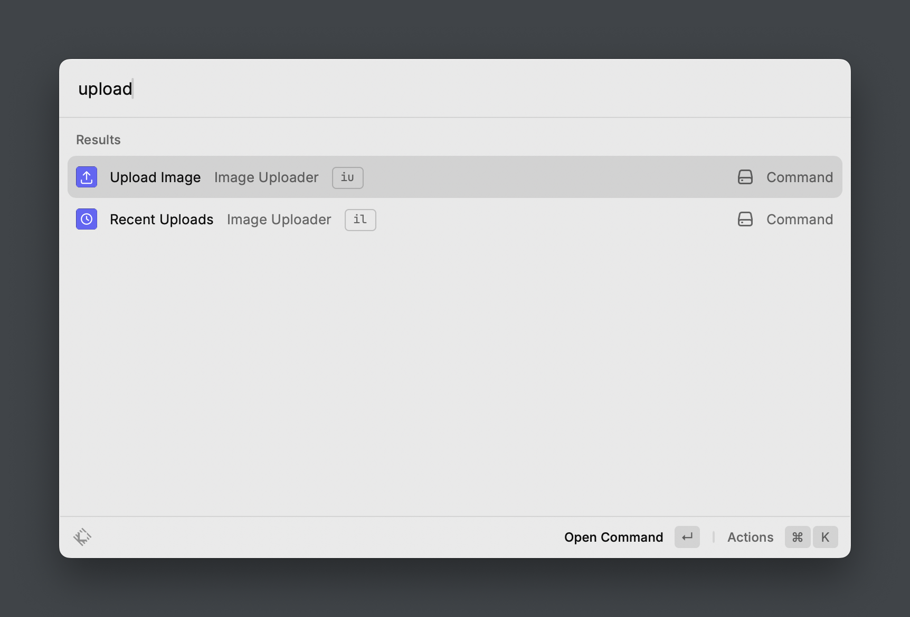
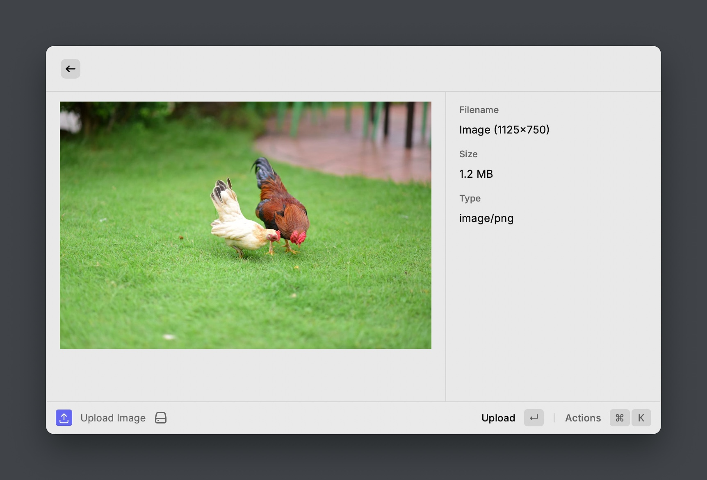

# raycast-image-uploader

A Raycast extension that uploads clipboard images to an S3-compatible endpoint and manages upload history.

## Features

- **Clipboard image upload** — reads images directly from your clipboard
- **Magic byte detection** — identifies file types by content when no extension is present (PNG, JPEG, GIF, WebP, HEIC, AVIF, TIFF, BMP, PDF, ZIP, GZIP, MP3, WAV, OGG, MP4)
- **File preview** — renders image previews inline and text/code files with syntax highlighting via fenced code blocks
- **Optimistic URL copy** — URL is copied to clipboard immediately before the upload completes
- **S3-compatible** — works with MinIO, AWS S3, and any S3-compatible endpoint
- **Upload history** — browse, search, and delete past uploads with inline previews

## Architecture

Clipboard → `file://` URI → `url.fileURLToPath` → read from disk → MIME detection (extension → magic bytes) → key generation (`{uuid}.{ext}`) → optimistic URL copy → S3 PUT → history save.

```
src/
├── upload-image.tsx      # view command — confirm and upload clipboard image
├── recent-uploads.tsx    # view command — browse upload history
└── lib/
    ├── mime.ts           # MIME detection (extension + magic bytes)
    ├── s3.ts             # S3 client, key generation, URL builder
    └── history.ts        # upload history (LocalStorage-backed)
```

### Key patterns

- **Optimistic upload**: URL is constructed and copied to clipboard before the S3 PUT request completes. History entry and success toast appear after the upload finishes.
- **S3Client reuse**: The S3 client is created once per command and reused across uploads via a ref, avoiding TLS handshake overhead.
- **Storage adapter pattern**: History uses an injectable `StorageAdapter` interface, making it testable without Raycast's `LocalStorage`.
- **Path-style URLs**: `forcePathStyle: true` is the default, required for self-hosted S3-compatible backends like MinIO.

## Commands

### Upload Image
Copies an image from your clipboard, uploads it to your configured S3 bucket, and puts the URL into your clipboard. Supports any file type — images render inline, text/code files render with syntax-highlighted previews, and other files show metadata.

If "Upload Without Asking" is disabled (default), you'll see a confirmation dialog before the upload starts.

### Recent Uploads
Browse your upload history with inline previews. Images render as thumbnails, text/code files show syntax-highlighted content, and other files show metadata. Copy URLs, open in browser, or delete entries from history using keyboard shortcuts (⌘Y, ⌘O, ⌘D).

### Screenshots





> Confirmation dialog before uploading to the S3-compatible backend.

## Configuration

| Preference | Description |
|---|---|
| S3 Endpoint | URL of your S3-compatible endpoint (use HTTPS in production) |
| Bucket Name | Target S3 bucket |
| Access Key ID | S3 access key |
| Secret Access Key | S3 secret key |
| Upload Without Asking | Skip confirmation dialog (default: off) |
| Recent Image Count | Number of uploads to keep in history (default: 50) |

## Security

- **Credential scoping**: Create an IAM/service account with `s3:PutObject` permission scoped to a single bucket. This limits damage if credentials are exposed via Raycast's preference plist.
- **HTTPS**: Use HTTPS for your S3 endpoint in production. The extension warns when `http://` is configured, as credentials and file data are transmitted in plaintext.
- **Object accessibility**: Uploaded objects must be publicly readable for the shared URL to work. Ensure your bucket policy allows `s3:GetObject` for anonymous users, or configure pre-signed URLs if you need access control.
- **No integrity checks**: The extension does not compute or verify checksums after upload. S3's transport-level MD5 validation covers data integrity during transit only.

## Development

```bash
npm install
npm run dev        # open in Raycast with hot reload
npm run build      # production build
npm test           # run unit tests
npm run lint       # check linting
```
